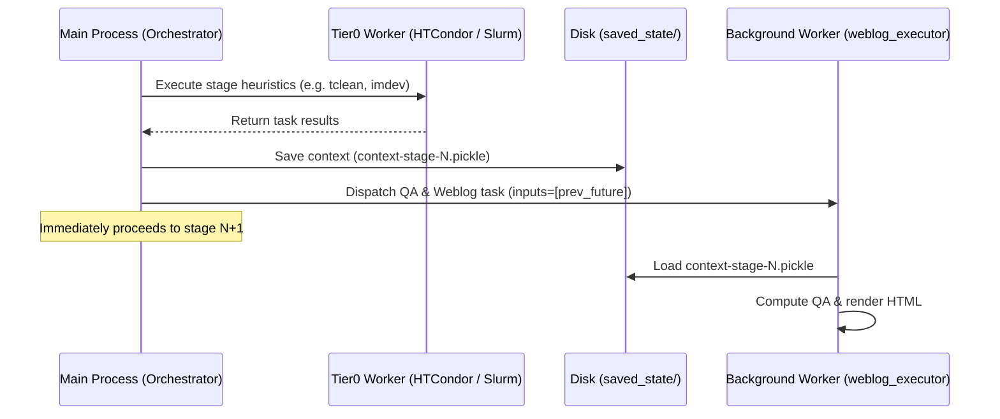

# 📡⚡ PAC-MAN

PAC-MAN (Pipeline Asynchronous Computing Manager) orchestrates [CASA](https://casa.nrao.edu/) pipeline execution using [Parsl](https://parsl-project.org/). It decouples core pipeline stage heuristics from synchronous QA evaluation and HTML Weblog rendering.

## Design and Execution Model

In the standard CASA pipeline, each stage runs task heuristics, evaluates QA metrics, and renders HTML templates synchronously on the main thread before the next stage can begin. PAC-MAN alters this execution model by checkpointing stage state and offloading QA and Weblog rendering to background Parsl tasks.



### Execution Touchpoints

1. **Synchronous Heuristic Execution**: Main pipeline heuristics execute synchronously. For parallel tasks, work is dispatched to compute workers ([HTCondor](https://htcondor.org/), [Slurm](https://slurm.schedmd.com/), or local processes) using `pipeline.infrastructure.parslhelpers`.
2. **Context Checkpointing**: After each stage completes, the pipeline context is saved to disk at `saved_state/context-stage-<stage>.pickle` via `cli.h_save()`.
3. **Detached QA & Weblog Evaluation**: A background task running on the `weblog_executor` pool loads the checkpoint via `cli.h_resume()`, executes QA algorithms via `pipelineqa.qa_registry.do_qa()`, writes scores back to the result proxy, and invokes `htmlrenderer.WebLogGenerator.render()`.
4. **Chained Weblog Writes**: Each stage's background task receives the future of the previous stage's rendering task via `inputs=[last_background_future]`. [Parsl](https://parsl.readthedocs.io/) enforces sequential execution across weblog tasks, preventing concurrent write collisions on `html/index.html`.
5. **Product Packaging Synchronization**: Stages that archive the weblog (e.g., `hifa_exportdata`, `hifv_exportdata`, `hif_exportdata`) block on in-flight background futures before execution, ensuring the packaged tarball contains all rendered stage reports.

## Quick Start

Execute a pipeline test run from a working directory using `--manifest-path`:

```bash
# Verify dataset resolution
pixi run --manifest-path "${PACMAN_ROOT:-../..}" pipeline-test --telescope vla --dry-run

# Run reduction
pixi run --manifest-path "${PACMAN_ROOT:-../..}" pipeline-test --telescope vla
```

For configuration options, backend setups, and monitoring, see the [User Guide](user_guide.md).

## References & Documentation

- [Parsl Documentation](https://parsl.readthedocs.io/) &mdash; [Babuji et al. (2019)](https://doi.org/10.1145/3307681.3325400)
- [CASA Documentation (CASAdocs)](https://casadocs.readthedocs.io/) &mdash; [CASA Team et al. (2022)](https://doi.org/10.1088/1538-3873/acac61)
- [HTCondor Manual](https://htcondor.readthedocs.io/) &mdash; [Thain et al. (2005)](https://doi.org/10.1002/cpe.938)
- Complete bibliography, BibTeX entries, and developer resources are available in the [References & Citations](references.md) guide.

