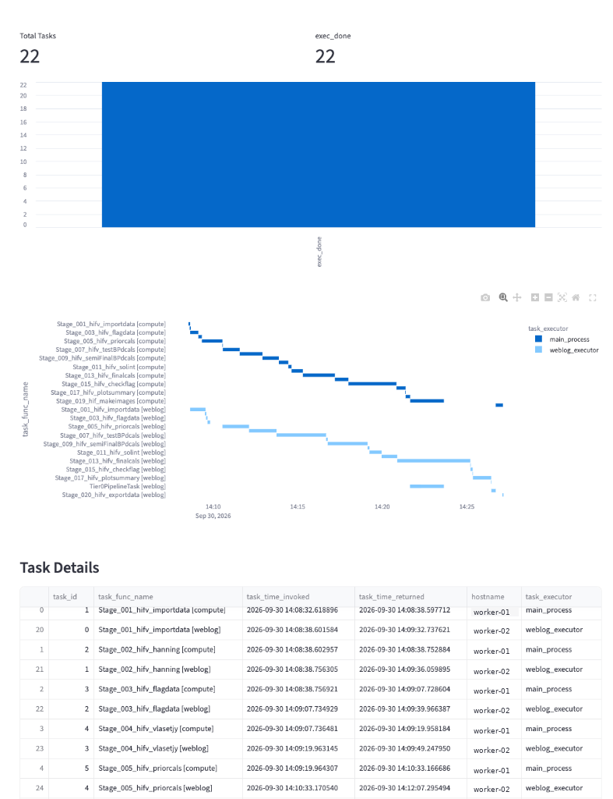

# User Guide

This guide describes how to configure and run the [CASA](https://casa.nrao.edu/) pipeline using PAC-MAN.

## 1. Environment Setup

PAC-MAN uses [Pixi](https://pixi.sh/) to manage CASA and pipeline dependencies.

Install dependencies and enter the environment shell:
```bash
pixi install
pixi shell
```

## 2. Executing a Pipeline Workflow

PAC-MAN provides `pac_man_reduce()` as a replacement for standard `recipereducer`. It accepts standard pipeline procedure definitions and MeasurementSets:

```python
from pac_man.runner import pac_man_reduce

context = pac_man_reduce(
    vis=['uid___A002_X123456_X789.ms'],
    procedure='procedure_hifv.xml',
    backend='subprocess'
)
```

### Supported Execution Backends

Specify the execution backend with the `backend` argument:

- `subprocess`: Spawns local worker processes via [Parsl HighThroughputExecutor](https://parsl.readthedocs.io/en/stable/stubs/parsl.executors.HighThroughputExecutor.html) (default for workstation runs).
- `htcondor`: Submits heavy compute jobs to [HTCondor](https://htcondor.org/) worker nodes with dedicated memory allocations (32 GB for compute, 8 GB for rendering).
- `slurm`: Submits jobs to a configured [Slurm](https://slurm.schedmd.com/) partition.
- `threads`: Runs tasks via `ThreadPoolExecutor`. **Not recommended for production runs** due to thread-safety limitations in CASA C++ libraries.

Example using HTCondor:
```python
context = pac_man_reduce(
    vis=['uid___A002_X123456_X789.ms'],
    procedure='procedure_hifv.xml',
    backend='htcondor',
    max_tier0_workers=50,
    max_weblog_workers=2
)
```

### CLI Pipeline Runner

PAC-MAN provides the `pipeline-test` task mapped to `scripts/test_pipeline.py`. To prevent polluting the repository root with runtime logs (`casapy.log`), plots, and checkpoints, pipeline runs are automatically isolated in `working/` when invoked from the repository root.

#### 1. Inside the Repository

Run directly from the repository root. The runner detects invocation from the workspace root via `INIT_CWD` and automatically routes execution into the gitignored `working/` directory:

```bash
# Run VLA reduction (default: subprocess backend, procedure_hifv.xml)
pixi run pipeline-test --telescope vla

# Run ALMA reduction with HTCondor backend
pixi run pipeline-test --telescope alma --backend htcondor

# Dry-run validation (checks dataset discovery and configuration without executing)
pixi run pipeline-test --telescope alma --dry-run
```

All CASA logs, checkpoints, and intermediate products are generated locally in `working/`, keeping the repository root clean.

#### 2. Custom Directory or Outside the Repository

To specify an explicit working directory, pass `--workdir` (or `-w`):

```bash
pixi run pipeline-test --telescope vla --workdir /path/to/scratch
```

When running from an external directory outside the repository (such as `/tmp` or a scratch filesystem), export `PACMAN_ROOT` and pass `--manifest-path` (or `-m`):

```bash
export PACMAN_ROOT=/path/to/pac-man

# Run from any external directory
pixi run --manifest-path "$PACMAN_ROOT" pipeline-test --telescope vla
```

Supported CLI options:

- `-t, --telescope`: Target telescope (`vla` or `alma`). Default: `vla`. Can also be passed positionally.
- `-b, --backend`: Parsl execution backend (`subprocess`, `htcondor`, `slurm`, `threads`). Default: `subprocess`.
- `-w, --workdir`: Target working directory for execution. Defaults to `working/` if invoked from the repository root.
- `--vis`: File path or relative CASA data path to a custom MeasurementSet.
- `-p, --procedure`: Pipeline recipe XML filename or path.
- `--exitstage`: Stage number at which to stop execution.
- `--dry-run`: Resolves dataset and validates parameters without executing reduction.
- `--loglevel`: Logging verbosity (`debug`, `info`, `warning`, `error`). Default: `info`.

## 3. Real-Time Monitoring

PAC-MAN provides multiple interfaces to track execution, task concurrency, and resource utilization.

### Execution Concurrency Model

PAC-MAN decouples heavy pipeline computations from QA assessment and WebLog rendering. While `main_process` executes pipeline stage heuristics, completed checkpoints trigger asynchronous `weblog_executor` tasks in the background:

```mermaid
gantt
    title Pipeline Stage & Background Weblog Concurrency
    dateFormat X
    axisFormat %M:%S

    section Compute (main_process)
    hifv_importdata [compute] :done, c1, 0, 10
    hifv_hanning [compute]    :done, c2, after c1, 2
    hifv_flagdata [compute]   :done, c3, after c2, 35
    hifv_vlasetjy [compute]   :done, c4, after c3, 15
    hifv_priorcals [compute]  :done, c5, after c4, 75
    hifv_syspower [compute]   :done, c6, after c5, 5
    hifv_testBPdcals [compute]:active, c7, after c6, 4

    section Background Weblog (weblog_executor)
    hifv_importdata [weblog]  :done, w1, 10, 60
    hifv_hanning [weblog]     :done, w2, after w1, 6
    hifv_flagdata [weblog]    :done, w3, after w2, 8
    hifv_vlasetjy [weblog]    :done, w4, after w3, 14
    hifv_priorcals [weblog]   :active, w5, 160, 168
```



---

### Streamlit Dashboard
Launch the [Streamlit](https://streamlit.io/) monitoring dashboard to track stage progress, execution durations, and background task states:

```bash
pixi run dashboard
```
The dashboard runs at `http://localhost:8502` and automatically discovers telemetry from `working/runinfo/monitoring.db`.



#### Interactive Timeline Widget

<details>
<summary><b>Interactive Telemetry Timeline</b> (click to expand &mdash; hover over tasks to inspect duration, worker assignment, and status, or drag to zoom)</summary>

<iframe src="assets/dashboard_timeline.html" width="100%" height="430px" frameborder="0" style="border: 1px solid #e0e0e0; border-radius: 6px; margin-top: 10px;"></iframe>

</details>

To refresh or regenerate the static timeline asset from a completed pipeline run:
```bash
pixi run export-dashboard
```

### Parsl Visualizer
Launch Parsl's built-in DAG [visualizer](https://parsl.readthedocs.io/en/stable/userguide/monitoring.html):

```bash
pixi run visualize
```
The visualizer runs at `http://localhost:8080`, displaying active worker nodes, task status graphs, and runtime resource metrics.

### Incremental Weblog
The pipeline weblog is rendered asynchronously to `html/index.html`. As each background stage finishes, refreshing the browser page reflects newly rendered stage details and QA scoring.

### CASA Log Output
The main console and `casapy.log` continue to record pipeline execution output according to standard [CASAdocs logging](https://casadocs.readthedocs.io/):
```bash
tail -f casapy.log
```

## References

For formal citations, DOIs, and developer manuals, see the [References & Citations](references.md) section.

